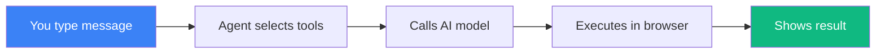
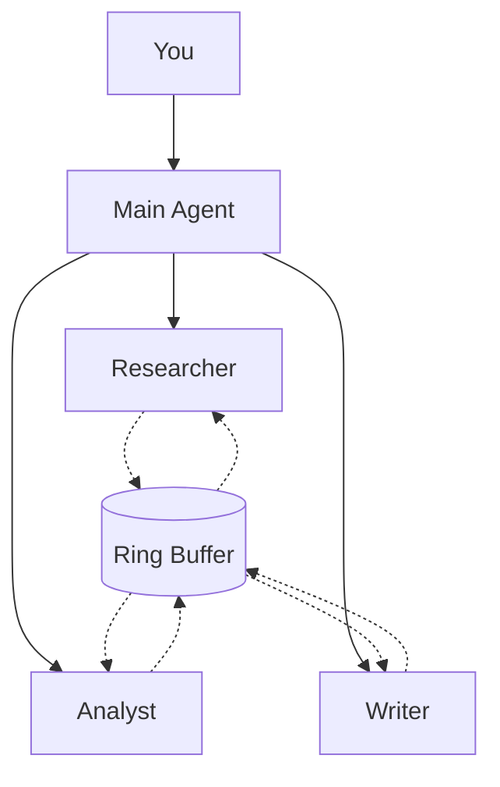

# agi.diy

[](LICENSE)
[](https://github.com/strands-agents/sdk-typescript)
[](#privacy)

**Build your own AGI. In your browser. Right now.**

[▶️ Launch](https://agi.diy) • [📖 SDK Docs](https://github.com/strands-agents/sdk-typescript) • [📱 Install as App](#install-as-pwa)

---

## Why agi.diy?

|  | ChatGPT/Claude.ai | agi.diy |
|--|-------------------|---------|
| **Privacy** | Data on their servers | 100% in your browser |
| **Cost** | $20-200/month subscription | Pay only for API usage |
| **Offline Mode** | ❌ | ✅ WebLLM runs locally |
| **Custom Tools** | Limited plugins | Create unlimited tools |
| **Multi-Agent** | ❌ | ✅ Coordinated agent teams |
| **Self-Modifying** | ❌ | ✅ Agent evolves itself |
| **Open Source** | ❌ | ✅ Fully auditable |

---

## Quick Start

**Use the hosted version:**
```bash
open https://agi.diy
```

**Or self-host:**
```bash
git clone https://github.com/cagataycali/agi-diy.git
cd agi-diy/docs && python3 -m http.server 8080
```

Then: **Settings** → Add API key → Start chatting

**Want 100% local?** Select WebLLM → Download model once → Works offline forever

---

## How It Works



Everything runs in your browser. The only external call is to the AI provider you choose (or none with WebLLM).

---

## What Can It Do?

### 🛠️ Create Custom Tools
Ask the agent to build tools on the fly:
```
"Create a tool that fetches Bitcoin price from CoinGecko"
```
The tool saves to localStorage and persists forever. Use it anytime:
```
"What's the current Bitcoin price?"
→ Uses your custom tool → "$67,432"
```

### 📧 Automate Email
```
"Every morning at 9am, check my Gmail and notify me of urgent emails"
```
Agent connects via Google OAuth, schedules a cron job, and sends push notifications.

### 💻 Pair Programming
```
"Watch my screen every 30 seconds and help me debug"
```
Agent captures your screen, spots errors, and suggests fixes in real-time.

### 👥 Multi-Agent Research
```
"Spawn researcher, analyst, and writer agents. Research AI safety."
```
Agents coordinate through ring attention—when one learns something, others see it.

### 🌙 Background Thinking
Ask about a topic, then walk away. Agent keeps exploring while you're gone. When you return, findings are injected into your next message.

### 🗺️ Location Intelligence
```
"Mark top 5 coffee shops near me and fly me through them"
```
Interactive Google Maps with GPS tracking and smooth camera animations.

---

## Two Modes

| Mode | File | What it's for |
|------|------|---------------|
| **Single Agent** | `index.html` | Personal assistant, coding help, quick tasks |
| **Multi-Agent** | `agi.html` | Research teams, parallel processing, scheduled automation |

### Multi-Agent Architecture



**Ring Attention:** Agents share context automatically. When the researcher finds papers, the analyst and writer see that context immediately.

---

## Models

### Cloud Models (API key required)

| Provider | Models | Best for |
|----------|--------|----------|
| **Anthropic** | Claude Opus, Sonnet, Haiku | Quality reasoning |
| **OpenAI** | GPT-4o, GPT-4, GPT-3.5 | General tasks |
| **Amazon Bedrock** | Claude + extended thinking | Deep analysis |

### Local Models (free, offline)

| Model | Size | Notes |
|-------|------|-------|
| **Qwen 2.5 3B** ⭐ | ~2GB | Recommended for most users |
| **Qwen 2.5 1.5B** | ~1GB | Faster, less capable |
| **Llama 3.2 1B** | ~700MB | Smallest, for mobile |
| **Hermes 8B** | ~4GB | Best tool usage |

*WebLLM requires Chrome/Edge 113+ with WebGPU*

---

## Tools Reference

### Core
- `render_ui` — Dynamic HTML components in chat
- `javascript_eval` — Execute JS, return results
- `storage_get/set` — Persistent localStorage
- `fetch_url` — HTTP requests
- `notify` — Push notifications (works in background)

### Self-Modification
- `create_tool` — Define new tools at runtime
- `list_tools` — See all available tools
- `delete_tool` — Remove tools
- `update_self` — Rewrite system prompt

### Vision & Context
- `get_user_context` — Activity state, mouse position, idle time
- `set_context` — Add custom context
- `scan_bluetooth` — Find nearby devices and agents

### Maps
- `add_map_marker` — Place markers with emoji/labels
- `fly_to_location` — Smooth camera animations
- `tour_markers` — Animated journey through points
- `get_map_location` — Current GPS position

### Google APIs
- `google_auth` — OAuth 2.0 authentication
- `use_google` — Access 200+ Google services
- `gmail_send` — Send emails directly

### Multi-Agent (agi.html only)
- `use_agent` — Spawn sub-agents
- `invoke_agent` — Call agent, wait for response
- `broadcast_to_agents` — Message all agents
- `scheduler` — Cron-based recurring tasks

---

## Ambient Mode

Agent thinks while you're away.

| Mode | Trigger | Behavior |
|------|---------|----------|
| 🌙 **Standard** | 30s idle | Runs 3 iterations, then pauses |
| 🚀 **Autonomous** | Click button | Runs until `[AMBIENT_DONE]` or stopped |

**How it works:** You ask about quantum computing, go make coffee. Agent explores applications, recent breakthroughs, industry adoption. When you return, those findings auto-inject into your next message.

---

## Privacy & Security

**Your data never leaves your browser** (except queries to your chosen AI provider).

| What | Where it's stored |
|------|-------------------|
| API Keys | localStorage (never transmitted) |
| Conversations | localStorage |
| Custom Tools | localStorage |
| Settings Sync | AES-256-GCM encrypted |

**With WebLLM:** Zero external calls. Everything runs on your GPU.

---

## Install as PWA

| Platform | Steps |
|----------|-------|
| **iOS** | Safari → Share → Add to Home Screen |
| **Android** | Chrome → Menu → Install app |
| **Desktop** | Click install icon in URL bar |

**Features:** Home screen icon, background notifications, offline support, settings sync between devices.

### Sync Settings

1. Settings → Sync → Enter password
2. Copy encrypted URL
3. On other device: paste URL, enter password
4. All settings transfer securely

---

## Configuration

### Get API Keys
- **Anthropic:** [console.anthropic.com](https://console.anthropic.com)
- **OpenAI:** [platform.openai.com](https://platform.openai.com)
- **Bedrock:** [AWS Console](https://console.aws.amazon.com/bedrock) → API Keys

### Extended Thinking (Bedrock)
Paste in Settings → API → Additional Request Fields:
```json
{
  "thinking": { "type": "adaptive" }
}
```

### Google OAuth
1. [Cloud Console](https://console.cloud.google.com/apis/credentials) → Create OAuth Client
2. Add authorized origin: `https://agi.diy`
3. Settings → Google → Paste Client ID

### URL Shortcuts
```
https://agi.diy/?q=what+time+is+it
```
Great for iOS Shortcuts—one tap to query.

---

## Console API

```javascript
agi.agent              // Agent instance
agi.clear()            // Clear conversation
agi.tools.list()       // List custom tools
agi.tools.delete(name) // Remove tool

agiContext.getContext()      // All context data
agiContext.scanBluetooth()   // Find nearby devices
```

---

## Troubleshooting

| Issue | Solution |
|-------|----------|
| No response | Settings → Check API key |
| WebLLM won't load | Use Chrome/Edge 113+ |
| Model download stuck | Refresh page |
| Screen capture denied | Allow browser permission |
| No notifications | Enable in browser settings |

---

## Project Structure

```
docs/
├── index.html        # Single agent mode
├── agi.html          # Multi-agent mode (upstream stable)
├── sauhsoj-ii.html   # Multi-agent mode (fork — structured transcript refactor)
├── strands.js        # Strands SDK bundle
├── vision.js         # Screen capture, ambient mode
├── webllm.js         # Local model inference
├── map.js            # Google Maps integration
├── tools/google.js   # Google API tools
├── sw.js             # Service worker (PWA)
└── manifest.json     # PWA config
```

### Fork Strategy

`sauhsoj-ii.html` is a fork of `agi.html` for experimental refactoring (structured transcripts, improved agent messaging). Both files share the same codebase origin.

- **`agi.html`** — tracks upstream (`cagataycali/agi-diy`), receives upstream changes directly
- **`sauhsoj-ii.html`** — diverges from `agi.html` at a recorded baseline commit, evolves independently

Baseline commits are recorded in a comment at the top of `sauhsoj-ii.html`. To incorporate upstream changes, diff `agi.html` from the recorded baseline to HEAD and apply to `sauhsoj-ii.html`.

### Navigating agi.html

`agi.html` contains a **Section Index TOC** at the top of its `<script>` block. Search for `═══ SECTION_NAME` to jump to any section. Each heading lists the key functions it contains.

```
STATE ................ App state, constants, config
PIPELINE MODEL ....... getPipelines, topoSort, renderPipelineFlow
MODEL PROVIDERS ...... AnthropicModel, OpenAIModel, BedrockModel
TOOLS ................ render_ui, javascript_eval, storage, fetch
AGENT MESH ........... P2P messaging, processIncomingCommand
MESH TOOLS ........... invoke_agent, broadcast, list_agents
SELF-MODIFICATION .... create_tool, update_self, custom tools
PIPELINE TOOLS ....... create_pipeline, add_task, update_task_status
SANDBOX TOOLS ........ sandbox_create, sandbox_update, preview mode
HOOKS ................ InterruptHook, SummarizingManager
GITHUB ............... auth, search, read, create PR
AGENT MANAGEMENT ..... createAgent, updateAgentUI, selectAgent
MESSAGING ............ runAgentMessage, sendMessage, clearChat
ACTIVITY FEED ........ appendActivityFeed, filterActivityFeed
UI RENDERING ......... addMessageToUI, streaming, tool calls, ring
MODALS ............... spawn, edit, settings
SYNC ................. encrypted export/import via URL
PERSISTENCE .......... saveState, loadState, credentials
CUSTOM TOOLS UI ...... tool management panel
INIT ................. DOMContentLoaded, query params, startup
```

> **For AI agents:** Use this TOC as a fast lookup — grep for the section heading to find the right code block. When adding new functions, update both the section heading's function list and the TOC at the top of the script to keep them in sync.

---

## Contributing

PRs welcome for:
- ✅ New tools
- ✅ Model providers
- ✅ Bug fixes
- ❌ Build systems
- ❌ Framework dependencies

The project is intentionally minimal—single HTML files, no build step, fully auditable.

---

## License

Apache 2.0

---

<p align="center">
Built with <a href="https://github.com/strands-agents/sdk-typescript">Strands Agents SDK</a><br>
<a href="https://agi.diy"><strong>agi.diy</strong></a>
</p>
