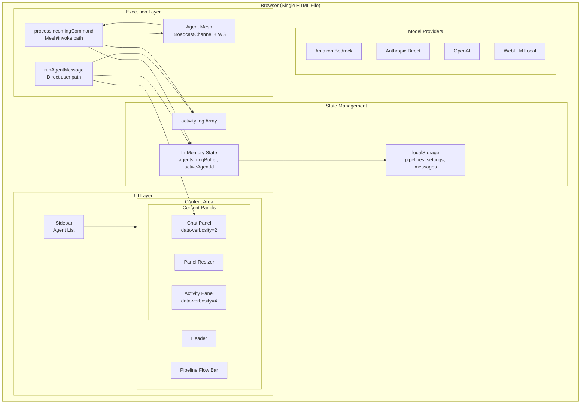
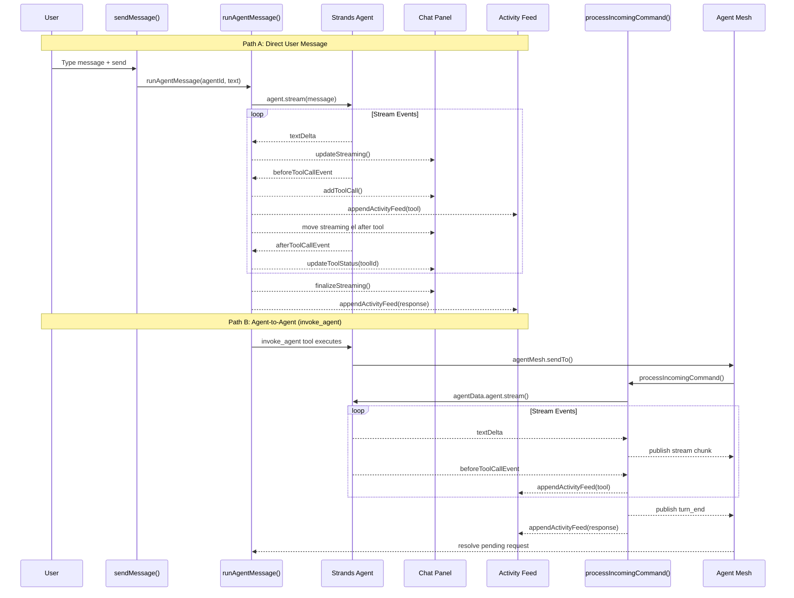
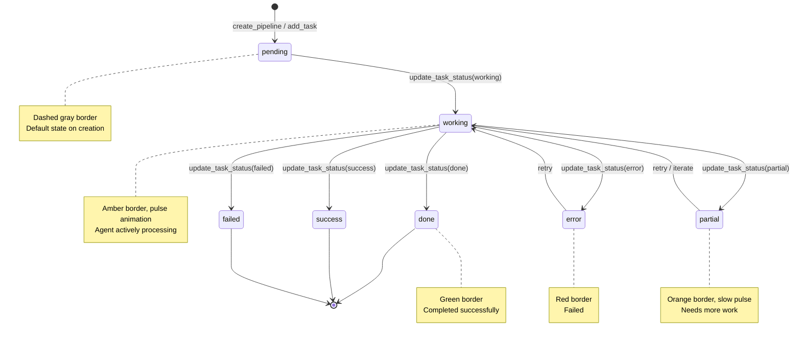
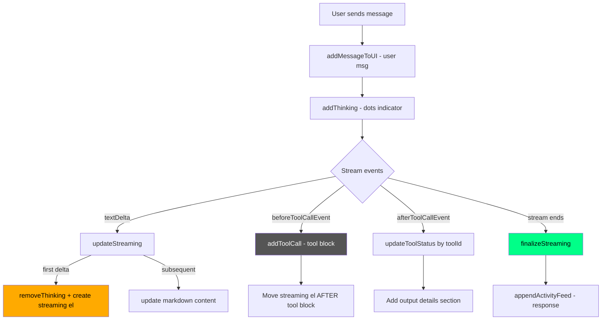
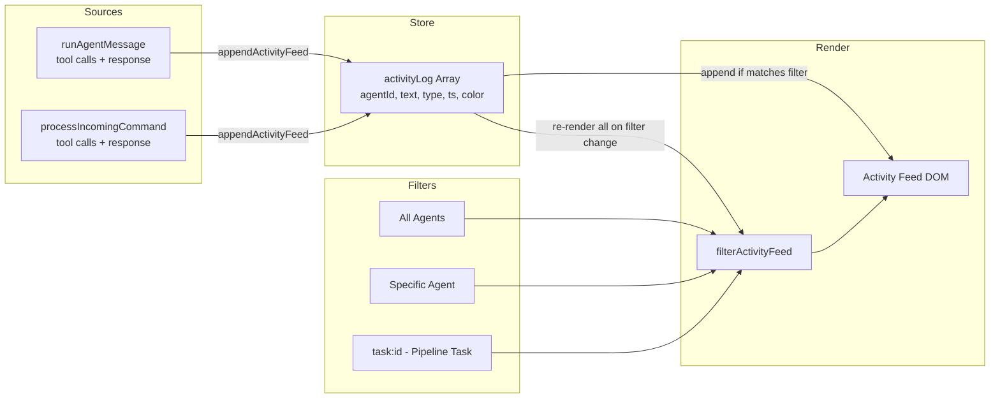
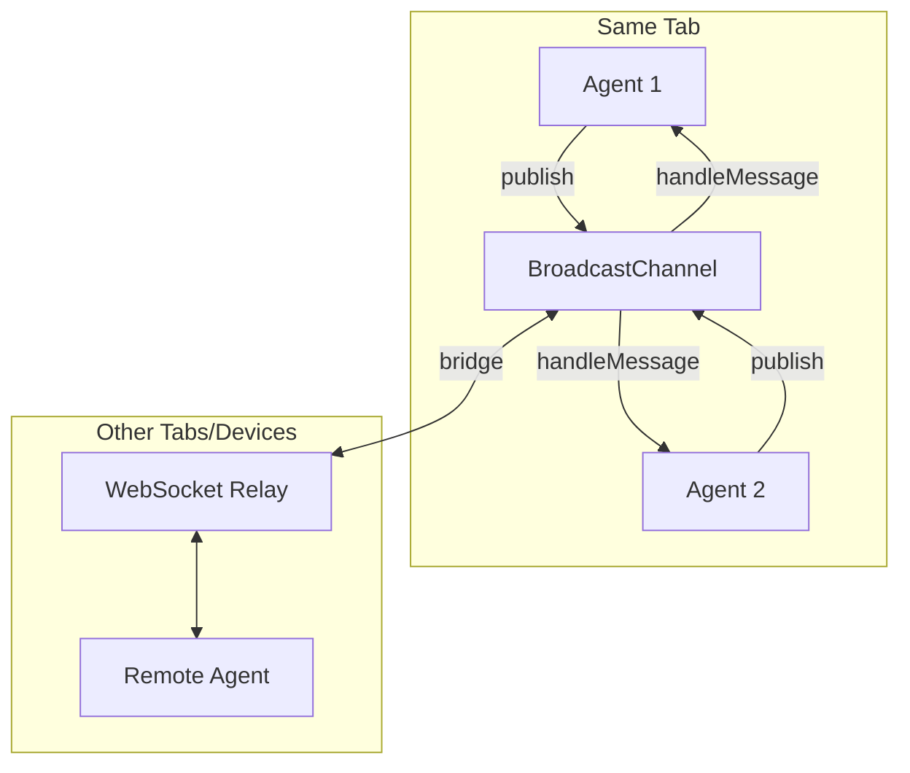

# KAA Multi-Agent Architecture

*Last updated: 2026-02-07*

## 1. System Architecture Overview



## 2. Agent Execution Flow



## 3. Pipeline State Machine



### Visual States

| State | Border | Color | Animation | Meaning |
|-------|--------|-------|-----------|---------|
| `pending` | dashed | #888 gray | none | Created, waiting for deps |
| `working` | solid | #ffaa00 amber | pillPulse 2s | Agent actively processing |
| `done` / `success` | solid | #00ff88 green | none | Completed successfully |
| `error` / `failed` | solid | #ff6666 red | none | Failed |
| `partial` | solid | #ff9933 orange | pillPulse 3s | Needs more work |

## 4. Message Rendering Lifecycle



### Key Design: Single Streaming Element

Instead of finalizing the streaming element before each tool block (which created duplicates), we move the single streaming element after each tool block. This means:
- Tool blocks appear in chronological order
- Text accumulates in one element
- No duplicate messages

## 5. Activity Feed Data Flow



### Why Data-Driven?

The original DOM-based feed had critical bugs:
- Clicking a pipeline box destroyed all feed entries (`innerHTML = ''`)
- Switching filters lost data permanently
- No way to restore previous entries

The `activityLog[]` array stores everything. Filtering re-renders from the array. Data is never lost.

## 6. Panel Layout

```
┌─────────────────────────────────────────────────────────────────┐
│ .app (display: flex)                                            │
│ ┌──────────┐ ┌────────────────────────────────────────────────┐ │
│ │ aside     │ │ .content-area (flex: 1, flex-direction: col)  │ │
│ │ .sidebar  │ │ ┌──────────────────────────────────────────┐  │ │
│ │           │ │ │ header.header                             │  │ │
│ │ • agent 1 │ │ ├──────────────────────────────────────────┤  │ │
│ │ • agent 2 │ │ │ .pipeline-flow (full width, overflow-x)  │  │ │
│ │ • agent 3 │ │ │ [×][Box]──[Box]──[Box]──[Box]──[Box]     │  │ │
│ │           │ │ ├──────────────────────────────────────────┤  │ │
│ │ + New     │ │ │ .content-panels (display: flex)           │  │ │
│ │           │ │ │ ┌──────────┐│ ┐│┌──────────────────────┐ │  │ │
│ │ SCHEDULED │ │ │ │chat-panel││R││ │ activity-panel       │ │  │ │
│ │           │ │ │ │          ││e││ │                      │ │  │ │
│ │           │ │ │ │ [verb ▾] ││s││ │ [filter▾] [verb ▾]  │ │  │ │
│ │           │ │ │ │          ││i││ │                      │ │  │ │
│ │           │ │ │ │ messages ││z││ │ activity feed        │ │  │ │
│ │           │ │ │ │          ││e││ │                      │ │  │ │
│ │           │ │ │ │          ││r││ │                      │ │  │ │
│ │           │ │ │ │ ┌──────┐ ││ ││ │                      │ │  │ │
│ │           │ │ │ │ │input │ ││ ││ │                      │ │  │ │
│ │           │ │ │ └──────────┘│ │└──────────────────────┘ │  │ │
│ │           │ │ └──────────────────────────────────────────┘  │ │
│ └──────────┘ └────────────────────────────────────────────────┘ │
└─────────────────────────────────────────────────────────────────┘
```

- Both panels `flex: 1` (equal width by default)
- Resizer: 4px wide, draggable, clamped 20-80%
- Pipeline flow spans full width above both panels

## 7. Verbosity System

| Level | Label | Shows | Hides |
|-------|-------|-------|-------|
| 1 | Chat | Messages only | Widgets, all tool blocks |
| 2 | Chat + Widgets | Messages + sandbox iframes | All tool blocks |
| 3 | + Tool Summary | Above + tool name/status bar | Tool input/output details |
| 4 | + Tool Details | Everything | Nothing |

**Implementation:** CSS attribute selectors on parent panel:
```css
[data-verbosity="1"] .tool-block, [data-verbosity="1"] .sandbox-wrap { display: none !important; }
[data-verbosity="2"] .tool-block { display: none !important; }
[data-verbosity="3"] .tool-block details { display: none !important; }
```

- Left panel default: Level 2 (Chat + Widgets)
- Right panel default: Level 4 (+ Tool Details)
- No JS filtering needed — pure CSS

## 8. Key Data Structures

### State Object
```javascript
state = {
    agents: Map<agentId, AgentData>,
    activeAgentId: string | null,
    ringBuffer: Array<{ agentId, role, content, timestamp }>,  // max 100
    settings: { provider, modelId, apiKey, ... }
}
```

### AgentData
```javascript
{
    config: { provider, modelId, maxTokens, systemPrompt, enabledTools, toolChoice, additionalRequestFields },
    agent: Agent,           // Strands SDK instance
    messages: Array<{ role, content, timestamp }>,
    status: 'ready' | 'processing' | 'error',
    color: string           // hex color for UI
}
```

### Pipeline
```javascript
{
    id: string,
    name: string,
    tasks: Array<Task>,
    completionActions: Array<{ type, description }>,
    createdAt: number
}
```

### Task
```javascript
{
    id: string,
    name: string,
    dependsOn: string[],    // task IDs
    status: 'pending' | 'working' | 'done' | 'success' | 'error' | 'failed' | 'partial',
    assignedTo: string | null,
    color: string,
    activities: Array<{ text, done, timestamp }>
}
```

### Activity Log Entry
```javascript
{
    agentId: string,
    text: string,           // up to 300 chars displayed
    type: 'msg' | 'tool',
    ts: number,
    color: string
}
```

### Tracking Maps
```javascript
streamingEls: Map<agentId, HTMLElement>     // active streaming elements
abortControllers: Map<agentId, AbortController>  // cancellation
```

### Storage Keys
| Key | Contents |
|-----|----------|
| `agi_pipelines` | JSON array of Pipeline objects |
| `agi_settings` | Provider, model, API keys |
| `agi_state` | Agent configs and message history |
| `agi_custom_tools` | User-created tool definitions |

## 9. Pipeline Tools

| Tool | Purpose | Calls updatePipelineUI? |
|------|---------|------------------------|
| `create_pipeline` | Create pipeline with initial tasks | ✅ |
| `add_task` | Add task to existing pipeline | ✅ |
| `update_task_status` | Change task state + optional activity | ✅ |
| `update_task_deps` | Modify task dependencies | ✅ |
| `complete_pipeline` | Mark pipeline done, add completion actions | ✅ |
| `emit_status` | Add activity message to task | ⚠️ Only renderPipelineActivity |
| `read_pipeline` | Read current pipeline state | ❌ (read-only) |

## 10. Agent Mesh



Message types: `direct`, `broadcast`, `stream`, `ack`, `turn_end`, `error`
